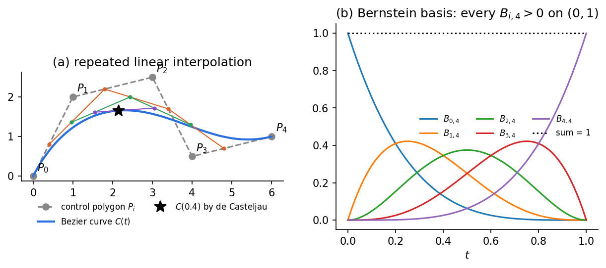
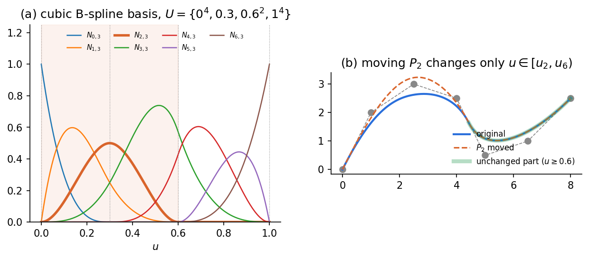
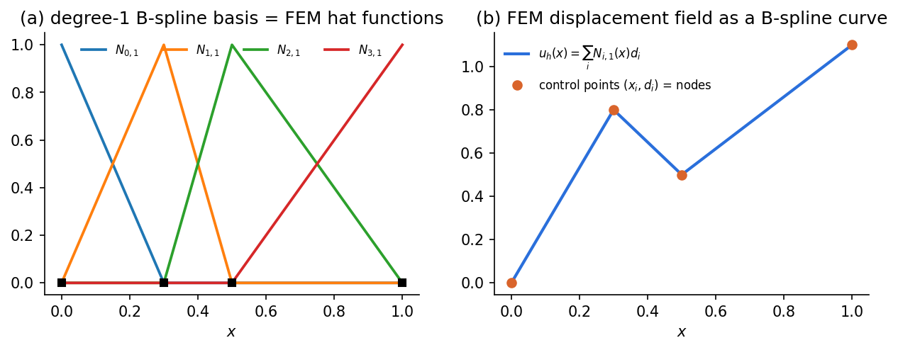
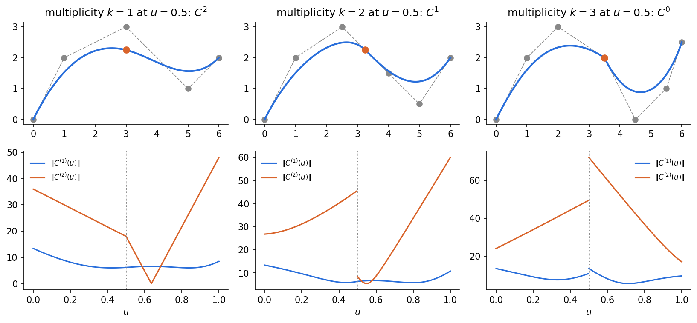

# Phase 1 — 曲線：STEPの `B_SPLINE_CURVE_WITH_KNOTS` を自分で評価する

設計部門から受け取ったSTEPファイルをテキストエディタで開くと、エッジの形状は次のような行で書かれている。

```text
#31 = B_SPLINE_CURVE_WITH_KNOTS('',3,(#32,#33,#34,#35,#36),
      .UNSPECIFIED.,.F.,.F.,(4,1,4),(0.,0.5,1.),.UNSPECIFIED.);
#32 = CARTESIAN_POINT('',(0.,0.,0.));
#33 = CARTESIAN_POINT('',(10.,20.,0.));
#34 = CARTESIAN_POINT('',(30.,30.,0.));
#35 = CARTESIAN_POINT('',(50.,10.,0.));
#36 = CARTESIAN_POINT('',(60.,20.,0.));
```

数字の並びは読めても、「`3` は何か」「`(4,1,4)` と `(0.,0.5,1.)` は何を決めるのか」「この5点を曲線は通るのか」は、多くの場合ブラックボックスのままである。この章の終わりには、この行から曲線上の任意の点を自分のコードで計算し、どこが滑らかでどこが折れ得るかを読み取れるようになる。

- 前提：線形代数と、固体力学トラック[Phase 4](../../solid-mechanics/texts/phase4-minimal-fem.md)の形状関数。微分幾何の知識は不要。
- 演習・答案：[Phase1.ipynb](../../../notebooks/cad/Phase1.ipynb)。NumPyとmatplotlibだけで動き、Google Colabでもそのまま実行できる。
- 到達点：Bézier曲線とB-spline曲線を自作コードで評価し、ノットベクトルから局所性・連続性を読み、ノット挿入で表現が変わっても形状が変わらないことを確かめる。
- 必須範囲：多項式（非有理）の曲線。有理式（NURBS）と曲面はPhase 2、トポロジはPhase 3で扱う。
- 演習では本文の式を既知として使ってよい。漸化式や挿入公式の証明は要求しない。

> **この章を貫く一つの見方**
> CADの曲線は、どれも「**制御点の重み付き平均**」である。パラメータ $u$ を動かすと重みが変わり、平均の位置が曲線を描く。Bézier・B-splineの違いは重みの作り方だけである。図形の感覚に頼らず、重みの性質（非負か、和は1か、どこで0になるか）を数値で確かめれば、幾何の性質が読める。

## 1. なぜ多項式を「貼り合わせる」のか

曲線を一つの式で表したい。最も素直なのは、パラメータ $t$（スカラー、$0\le t\le1$）の多項式を座標ごとに使う方法である。ただし、多くの点を通す高次の多項式は、等間隔の点で補間すると端で大きく振動する（Runge現象）。また、ある係数を変えると曲線全体が動く。

CADでは、次の三つを同時に満たす表現が必要になる。

| 要求 | 理由 |
| --- | --- |
| 次数は低く（多くは3次） | 評価が安定し、振動しにくい |
| 形状の修正は局所的に | フィレットの一部を直したとき、遠くの形状は動いてほしくない |
| 滑らかさを指定できる | 接線や曲率をつなぎたい箇所と、あえて折りたい箇所がある |

答えは「低次の多項式を区間ごとに作り、つなぎ目の滑らかさを制御して貼り合わせる」ことである。その前段として、一区間だけのBézier曲線から始める。

## 2. Bézier曲線：重み付き平均としての曲線

### 定義

制御点 $\mathbf P_0,\dots,\mathbf P_n$ を考える。各 $\mathbf P_i$ は2次元または3次元の**位置ベクトル**で、曲線が通るとは限らない「引っ張る点」である。$n$ は次数（整数）。Bézier曲線 $\mathbf C(t)$（ベクトル値関数）を

$$
\mathbf C(t)=\sum_{i=0}^{n}B_{i,n}(t)\,\mathbf P_i,\qquad
B_{i,n}(t)=\binom{n}{i}t^i(1-t)^{n-i}
$$

で定義する。$B_{i,n}$ は**Bernstein基底**と呼ばれるスカラー関数で、制御点 $\mathbf P_i$ に掛かる重みである。



### 重みの性質から、曲線の性質が出る

二項定理から $\sum_i B_{i,n}(t)=(t+1-t)^n=1$ であり、$0\le t\le1$ で $B_{i,n}(t)\ge0$ である（図(b)）。この二つから次が従う。

| 重みの性質 | 曲線の性質 | 意味 |
| --- | --- | --- |
| 和が1（1の分割） | **アフィン不変性**：全制御点を平行移動・回転すると、曲線も同じだけ動く | 座標系の取り方に依らない |
| 非負かつ和が1 | 曲線は制御点の凸包の中にある | 干渉判定の粗い検査に使える |
| $B_{0,n}(0)=1$、$B_{n,n}(1)=1$ | 両端で $\mathbf C(0)=\mathbf P_0$、$\mathbf C(1)=\mathbf P_n$ | 端点だけは必ず通る |
| $0<t<1$ で全ての $B_{i,n}>0$ | どの制御点を動かしても、曲線の内部全体が動く | 修正が**局所的でない** |

「和が1」は、固体力学Phase 4で形状関数が満たした $N_1+N_2=1$ と同じ条件である。Phase 4では、これが剛体並進を正しく表す（ひずみゼロ）ための条件だった。曲線の世界では、同じ条件が「曲線が座標系の平行移動に追従する」ことを保証する。

端の接線は $\mathbf C'(0)=n(\mathbf P_1-\mathbf P_0)$、$\mathbf C'(1)=n(\mathbf P_n-\mathbf P_{n-1})$ で、制御多角形の最初と最後の辺の向きを向く。

### de Casteljauのアルゴリズム：線形補間を繰り返す

Bernstein基底を直接計算しなくても、曲線上の点は**線形補間の繰り返し**で求まる。$\mathbf P_i^{(0)}=\mathbf P_i$ とし、

$$
\mathbf P_i^{(r)}=(1-t)\,\mathbf P_i^{(r-1)}+t\,\mathbf P_{i+1}^{(r-1)},\qquad r=1,\dots,n
$$

を繰り返すと、最後に残る1点 $\mathbf P_0^{(n)}$ が $\mathbf C(t)$ である（図(a)の色付き折れ線と星印）。各段は「辺を $t:(1-t)$ に内分する」だけなので、幾何の知識がなくても実装でき、数値的にも安定である。

### Bézier曲線の限界

- 制御点を1つ動かすと、曲線全体（両端を除く）が動く。
- 制御点の数を増やすと、次数も上がる。

これが、B-splineへ進む理由である。

## 3. B-spline：重みを「局所的」にする

### ノットベクトル

B-splineでは、重みを作るための区切りを**ノットベクトル** $U=\{u_0,u_1,\dots,u_m\}$ で与える。$u_j$ は非減少のスカラー列で、パラメータ $u$ の区間を分割する「つなぎ目」の位置である。同じ値が繰り返し現れてよく、繰り返しの回数を**多重度**と呼ぶ。

次数を $p$、制御点を $\mathbf P_0,\dots,\mathbf P_n$（$n+1$ 個）とすると、必ず

$$
m+1=(n+1)+p+1\qquad\text{（ノット数＝制御点数＋次数＋1）}
$$

が成り立つ。冒頭のSTEPの例では、$p=3$、制御点5個、ノットは `(0.,0.5,1.)` をそれぞれ `(4,1,4)` 回繰り返した $U=\{0,0,0,0,0.5,1,1,1,1\}$ の9個で、$9=5+3+1$ を満たす。

### Cox–de Boorの漸化式

B-spline基底 $N_{i,p}(u)$（スカラー関数、$i=0,\dots,n$）は、0次から順に作る。

$$
N_{i,0}(u)=
\begin{cases}1 & u_i\le u<u_{i+1}\\ 0 & \text{それ以外}\end{cases}
$$

$$
N_{i,p}(u)=\frac{u-u_i}{u_{i+p}-u_i}N_{i,p-1}(u)+\frac{u_{i+p+1}-u}{u_{i+p+1}-u_{i+1}}N_{i+1,p-1}(u)
$$

分母が0になる項（多重ノットで区間の長さが0になる場合）は、$0/0=0$ として落とす。各段は「隣り合う二つの基底を、$u$ の一次式の重みで混ぜる」操作であり、de Casteljauと同じく線形補間の繰り返しになっている。曲線は

$$
\mathbf C(u)=\sum_{i=0}^{n}N_{i,p}(u)\,\mathbf P_i
$$

である。



### 重みの性質（Bézierとの比較）

| 性質 | B-spline基底 $N_{i,p}$ | 帰結 |
| --- | --- | --- |
| 非負・1の分割 | $N_{i,p}\ge0$、$\sum_iN_{i,p}(u)=1$ | アフィン不変性・凸包性はBézierと同じ |
| **局所台** | $N_{i,p}(u)=0$（$u\notin[u_i,u_{i+p+1})$） | $\mathbf P_i$ を動かしても、曲線は $u\in[u_i,u_{i+p+1})$ の部分しか動かない（図(b)） |
| 区間ごとに多項式 | 各ノット区間 $[u_j,u_{j+1})$ で $p$ 次多項式 | 次数は制御点数と無関係に低く保てる |
| 非零は $p+1$ 個 | 1つの区間で非零の基底は $N_{j-p,p},\dots,N_{j,p}$ | 評価の計算量は制御点数に依らない |

最後の性質が実装の要点である。$u$ を含む区間の番号 $j$（**スパン**、$u_j\le u<u_{j+1}$）を先に探し、そのスパンで非零の $p+1$ 個だけを漸化式で計算すればよい。

### 端点の扱い：開ノットベクトル

両端のノットを $p+1$ 重にしたもの（例：$\{0,0,0,0,\dots,1,1,1,1\}$）を**開ノットベクトル**（clamped）と呼ぶ。このとき曲線は最初と最後の制御点を通り、端の接線は制御多角形の端の辺に沿う。CADの曲線のほとんどはこの形である。

内部ノットがない開ノットベクトル $\{0^{p+1},1^{p+1}\}$ では、B-spline基底はBernstein基底に一致する。**Bézier曲線はB-splineの特別な場合**である。

実装上の注意として、定義の半開区間 $u_i\le u<u_{i+1}$ のままでは、右端 $u=u_m$ で全ての $N_{i,0}$ が0になり、曲線が評価できない。右端では最後の非退化区間を閉区間として扱う。演習ではこの処理を含むスパン探索関数を配布する。

## 4. 1次B-splineは、FEMの形状関数だった

$p=1$、節点位置 $x_0<x_1<\dots<x_n$ をそのままノットにした開ノットベクトル $U=\{x_0,x_0,x_1,\dots,x_{n-1},x_n,x_n\}$ を考える。漸化式を1段だけ使うと、$N_{i,1}$ は節点 $x_i$ で1、隣の節点で0となる折れ線、すなわち**Phase 4の全体[形状関数](../../glossary.md#形状関数)（ハット関数）そのもの**になる。



したがって、Phase 4の近似変位場 $u_h(x)=\sum_iN_i(x)\,d_i$ は、制御点を $(x_i,d_i)$ とする1次B-spline曲線のグラフとして読める（図(b)）。ここから三つの対応が見える。

| B-splineの性質 | FEMでの意味 |
| --- | --- |
| 1の分割 | 全節点が同じ量動くと剛体並進になる（ひずみゼロ） |
| 線形精度：$\sum_iN_{i,1}(x)\,x_i=x$ | 線形変位（一定ひずみ）を厳密に表せる。パッチテストの前提 |
| 局所台 | $N_i$ と $N_j$ の台が重ならなければ $K_{ij}=0$。剛性行列が帯行列になる |

線形精度は次数 $p$ でも成り立つ。係数として節点位置の代わりに**Greville点** $\xi_i=(u_{i+1}+\dots+u_{i+p})/p$（スカラー）を使うと、$\sum_iN_{i,p}(u)\,\xi_i=u$ となる。$p=1$ では $\xi_i=u_{i+1}=x_i$ で、上の式に戻る。

次数を上げると、各基底の台は $p+1$ 区間に広がり、重なる基底が増える。1行あたりの非零成分は内部で $2p+1$ 個になる（演習3で確かめる）。高次の基底で解析すると何が得られ、何が失われるかは、Phase 8（等幾何解析）の主題である。

## 5. ノットの多重度と連続性

### 区間の内部は無限回微分可能、問題はつなぎ目

各スパンの中で曲線は多項式なので、何回でも微分できる。滑らかさが問題になるのはノットの位置だけである。多重度 $k$ のノットでは、曲線は**少なくとも $C^{p-k}$ 級**（$p-k$ 階導関数まで連続）になる。

| 3次（$p=3$）で内部ノットの多重度 $k$ | 保証される連続性 | 見た目 |
| --- | --- | --- |
| 1 | $C^2$：位置・接線・2階導関数が連続 | 滑らか |
| 2 | $C^1$：接線まで連続 | 滑らかに見えるが、曲がり方が急に変わり得る |
| 3 | $C^0$：位置だけ連続 | 折れ得る |
| 4 | 不連続になり得る | 途切れ得る |



図の下段は、導関数ベクトルの大きさ $\|\mathbf C^{(r)}(u)\|$ である。$k=2$ では2階導関数が、$k=3$ では1階導関数が $u=0.5$ で跳ぶ。

「少なくとも」と書いたのは、制御点の配置によっては、保証より滑らかになる場合があるからである。これは演習5のノット挿入で確かめる。

### 導関数もB-splineである

$p$ 次B-spline曲線の導関数は、次数 $p-1$ のB-spline曲線になる。

$$
\mathbf C'(u)=\sum_{i=0}^{n-1}N_{i+1,p-1}(u)\,\mathbf Q_i,\qquad
\mathbf Q_i=\frac{p}{u_{i+p+1}-u_{i+1}}\left(\mathbf P_{i+1}-\mathbf P_i\right)
$$

ここで $N_{i+1,p-1}$ は元の $U$ 上の基底、つまり両端のノットを1つずつ除いた $U'=\{u_1,\dots,u_{m-1}\}$ 上の $N_{i,p-1}$ である。$\mathbf Q_i$ は新しい「制御点」だが、位置ではなく速度の次元を持つベクトルである。分母が0になる場合は $\mathbf Q_i=\mathbf 0$ とする（対応する基底は恒等的に0）。この式を繰り返し使えば、任意の階数の導関数が同じ評価コードで計算できる。

ノット位置での片側極限は、**左右どちらのスパンの多項式を使うか**を指定して評価すればよい。多項式はスパンの端まで連続に延長できるので、左のスパンの多項式を $u=u_j$ で評価した値が左極限になる。

### パラメトリック連続 $C^k$ と幾何的連続 $G^k$

CADの「接線連続」「曲率連続」は、$C^1$・$C^2$ ではなく**幾何的連続** $G^1$・$G^2$ を指すことが多い。

- $C^1$：つなぎ目で導関数ベクトル $\mathbf C'(u)$ が一致する。
- $G^1$：つなぎ目で接線の**向き**が一致する（大きさは違ってよい）。

$\mathbf C'(u)$ の大きさは「パラメータ $u$ が進むときに曲線上を動く速さ」であり、形状ではなくパラメータの付け方に依存する。同じ形状でも、パラメータの付け方を変えれば $C^1$ でなくなり得る。形状の性質を語るときは $G^k$、評価コードの性質を語るときは $C^k$ を使う。

実務との関係を一つ挙げる。直線と円弧をつないだフィレットは $G^1$ だが、曲率は0から $1/R$ へ跳ぶ（$G^2$ でない）。曲率の跳びはPhase 5でメッシュ寸法を決める目安になり、フィレット半径 $R$ はPhase 6で応力集中の支配量として再登場する。

## 6. ノット挿入：表現は変わっても、形状は変わらない

ノット $\bar u\in[u_k,u_{k+1})$ を1つ挿入すると、制御点は1つ増える。新しい制御点 $\mathbf Q_i$ は

$$
\mathbf Q_i=
\begin{cases}
\mathbf P_i & i\le k-p\\
\alpha_i\mathbf P_i+(1-\alpha_i)\mathbf P_{i-1},\quad \alpha_i=\dfrac{\bar u-u_i}{u_{i+p}-u_i} & k-p+1\le i\le k\\
\mathbf P_{i-1} & i\ge k+1
\end{cases}
$$

で与えられる（Boehmのアルゴリズム）。ここでも操作は隣り合う制御点の線形補間だけである。

挿入の前後で、**曲線は点ごとに同一**である。細かいノットの基底は元の基底をすべて表せる（関数空間が広がるだけ）ためである。ここから二つの教訓が出る。

1. **同じ形状に、表現は一つではない。** 別のCADから出力したSTEPは、同じ形状でもノットや制御点が異なり得る。形状が同じかどうかは、制御点ではなく曲線上の点（またはそれらの距離）で比べる。この考え方は、Phase 4以降の形状の再生成チェックや、Phase 7の自動化での比較で使う。
2. **形状を変えずに近似空間を細かくできる。** FEMでメッシュを細分化すると通常は形状の近似も変わるが、ノット挿入では形状が厳密に保たれる。これが、Phase 8（等幾何解析）のh細分化にあたる。

## 7. STEPの行へ戻る

冒頭の `B_SPLINE_CURVE_WITH_KNOTS` の引数は、次の順に並ぶ。

| 引数 | 例の値 | 意味 |
| --- | --- | --- |
| 名前 | `''` | 空でよい |
| 次数 $p$ | `3` | 3次 |
| 制御点のリスト | `(#32,…,#36)` | $\mathbf P_0,\dots,\mathbf P_4$。曲線が通るのは両端だけ |
| 曲線の形式 | `.UNSPECIFIED.` | 円弧などの特別な形であることを宣言しない |
| 閉曲線か | `.F.` | 閉じていない |
| 自己交差 | `.F.` | 交差しない |
| 多重度のリスト | `(4,1,4)` | 各ノット値の繰り返し回数 |
| ノット値のリスト | `(0.,0.5,1.)` | 重複のないノット値 |
| ノットの種類 | `.UNSPECIFIED.` | 等間隔などの特別な種類を宣言しない |

したがって、この曲線は $U=\{0,0,0,0,0.5,1,1,1,1\}$ の開ノットベクトルをもつ3次B-splineで、2つの3次多項式を $u=0.5$ で $C^2$ につないだものである。点 $(0,0,0)$ と $(60,20,0)$ を通り、他の3点は通らない。STEPのノットは多重度とノット値に分けて書かれているので、評価の前に展開する。

重み付きの `RATIONAL_B_SPLINE_CURVE` や、面の定義 `B_SPLINE_SURFACE_WITH_KNOTS` は、Phase 2で同じ枠組みを拡張して読む。

## Phase 1の出口と適用限界

この章で扱ったのは、次の仮定の下の曲線である。

| 仮定 | 外すと何が変わるか | 扱う場所 |
| --- | --- | --- |
| 多項式（非有理）である | 円・楕円を厳密に表せない。重みを導入したNURBSが必要 | Phase 2 |
| 曲線（1パラメータ）である | 曲面ではテンソル積と法線・曲率が必要 | Phase 2 |
| 開ノットベクトル | 周期ノット（閉曲線）の扱いが別に必要 | 必要時に補足 |
| パラメータは弧長ではない | $u$ を等間隔に取っても、曲線上の点は等間隔にならない。メッシュ分割は弧長や弦高で決める | Phase 5 |
| 単独の曲線 | エッジとして面の境界になると、許容差や向きなどのトポロジ情報が加わる | Phase 3 |

この章で語れるようになったこと：

- CADの曲線は制御点の重み付き平均であり、重みの性質（1の分割・非負・局所台）が曲線の性質（アフィン不変性・凸包性・局所変形）を決める。
- ノットベクトルは区間の区切りと滑らかさを決め、多重度 $k$ のノットでは少なくとも $C^{p-k}$ が保証される。
- 1次B-splineはFEMの形状関数そのものであり、1の分割・線形精度・局所台はFEMの剛体並進・パッチテスト・帯行列に対応する。
- 同じ形状に表現は一つではない。形状の比較は曲線上の点で行う。

## 記号の一覧

| 記号 | 型 | 役割 |
| --- | --- | --- |
| $t$ | スカラー | Bézier曲線のパラメータ（$0\le t\le1$） |
| $u$ | スカラー | B-spline曲線のパラメータ |
| $\mathbf P_i$ | ベクトル（2次元または3次元） | 制御点 |
| $\mathbf C(t)$、$\mathbf C(u)$ | ベクトル値関数 | 曲線上の点 |
| $\mathbf C^{(r)}(u)$ | ベクトル値関数 | $r$ 階導関数 |
| $n$ | 整数 | Bézierでは次数、B-splineでは制御点数−1 |
| $p$ | 整数 | B-splineの次数 |
| $B_{i,n}(t)$ | スカラー関数 | Bernstein基底 |
| $U=\{u_0,\dots,u_m\}$ | 非減少のスカラー列（1次元配列） | ノットベクトル |
| $N_{i,p}(u)$ | スカラー関数 | B-spline基底 |
| $k$ | 整数 | ノットの多重度 |
| $\mathbf Q_i$ | ベクトル | 導関数曲線の制御点、またはノット挿入後の制御点（文脈で区別） |
| $\xi_i$ | スカラー | Greville点 |
| $\bar u$ | スカラー | 挿入するノット |

用語の短い定義は[用語集](../../glossary.md#bspline-knots)にもまとめた。
